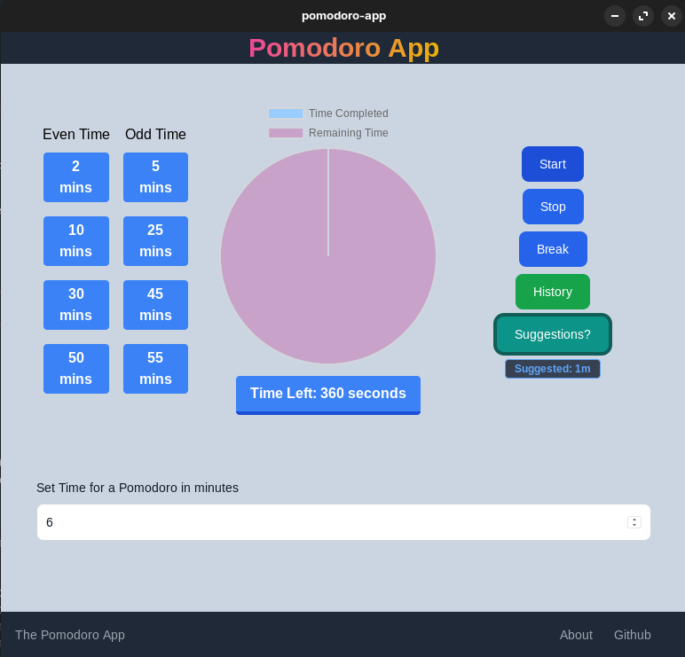
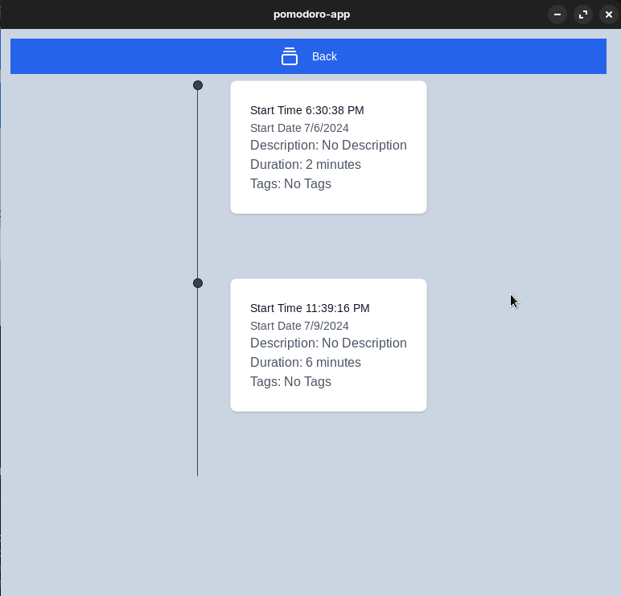

# Pomodoro App

Quote: `Your worktime, you decide`

## Interface

### Homescreen

### History Page

## Features

* Interactive Home Screen
* In built statical model for user activity based suggestion
* Activty tracking in history page
* Every data is store locally we do not store any data

## I actually got inspired by [pomodoro-cli](https://github.com/open-pomodoro/openpomodoro-cli)

Also make you before using it you install [pomodoro-cli](https://github.com/open-pomodoro/openpomodoro-cli)
